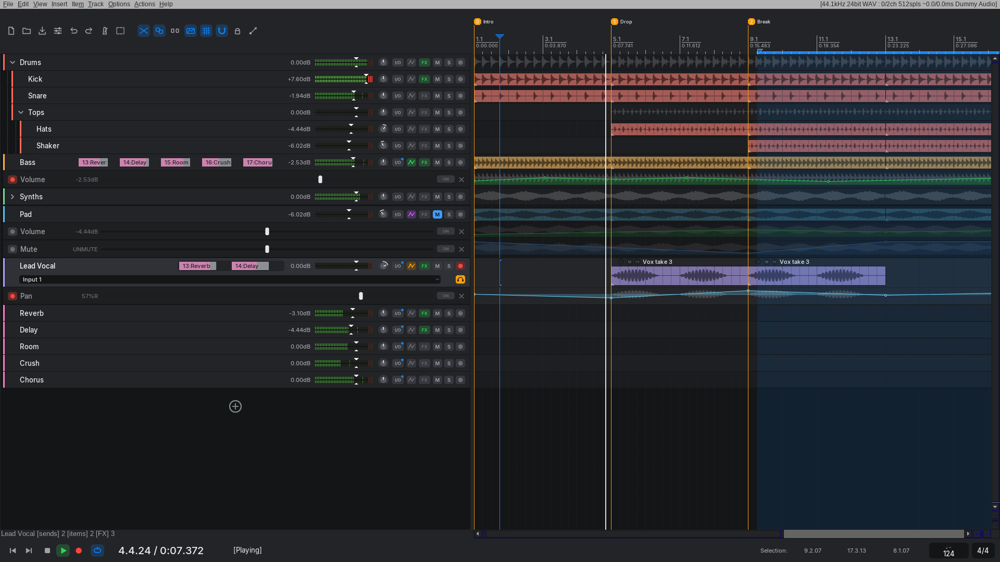
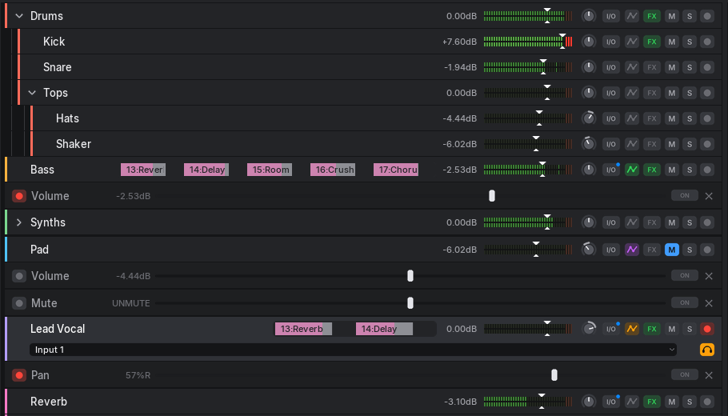
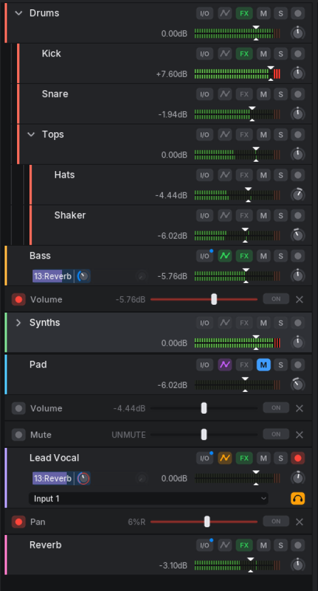

# Beautiful Reaper

A calm, modern theme for REAPER 7, inspired by Ableton Live and Bitwig and
designed along Apple's Human Interface Guidelines: one opinionated layout
instead of endless options, and only the controls a producer needs, each in
one place.



## What's different

- **The track panel is the whole channel.** Name, sends, dB value, LED meter
  with the volume fader on top, pan, I/O, automation, FX, mute, solo and arm
  sit on one row. The mixer can stay closed and the screen height goes to
  tracks.
- **Meters you can read.** Segmented LED meters in muted greens, amber just
  below 0 dB, and a big red clip block that latches until you click it.
- **Folders are a tree.** Children are indented as whole cards, with indent
  guides, like a file explorer, and a large disclosure chevron.
- **Sends like Ableton.** One value box per send, filled in the destination
  track's color. Drag to change the level.
- **Responsive.** On a narrow panel the level block wraps to a second row;
  with many sends they get their own row; armed tracks add an input row.
  Nothing is ever squeezed into unreadable.
- **Sharp at any size.** Images, layouts and fonts for 100, 125, 150, 175,
  200, 250 and 300% UI scale.

<p>
  
  
</p>

## Install

### With ReaPack (recommended)

1. Install [ReaPack](https://reapack.com) if you don't have it yet.
2. In REAPER: **Extensions → ReaPack → Import repositories…** and paste:

   ```
   https://github.com/onliner10/BeautifulReaper/raw/main/index.xml
   ```

3. **Extensions → ReaPack → Browse packages**, search for
   **Beautiful Reaper**, right-click → **Install**, then **Apply**.
4. **Options → Themes → BeautifulReaper**.

ReaPack will offer updates automatically (**Extensions → ReaPack →
Synchronize packages**).

### Manually

Download
[`dist/BeautifulReaper.ReaperThemeZip`](dist/BeautifulReaper.ReaperThemeZip)
and drag it onto the REAPER window (or copy it to REAPER's `ColorThemes`
folder: **Options → Show REAPER resource path**), then select it under
**Options → Themes**.

### Recommended REAPER settings

- Close the mixer (**View → Mixer**, Ctrl+M): levels, sends and routing are
  on the tracks.
- Widen the track panel if you use many sends; the theme adapts to any width.

## Build from source

Everything (images at every scale, colors, fonts, layout) is generated from
`src/`:

```sh
pip install pillow
python3 src/build.py          # -> dist/BeautifulReaper.ReaperThemeZip
python3 tools/make_index.py   # -> index.xml (after bumping VERSION)
```

- `src/palette.py` – every color, in one place
- `src/images.py` – vector-drawn buttons, knobs, meters, icons
- `src/rtconfig.txt` – the WALTER layout
- `tools/screenshot.sh` – renders REAPER headless (Xvfb) for screenshots

## License

MIT (see [LICENSE](LICENSE)). Inter font: SIL Open Font License
(`src/fonts/OFL.txt`).
